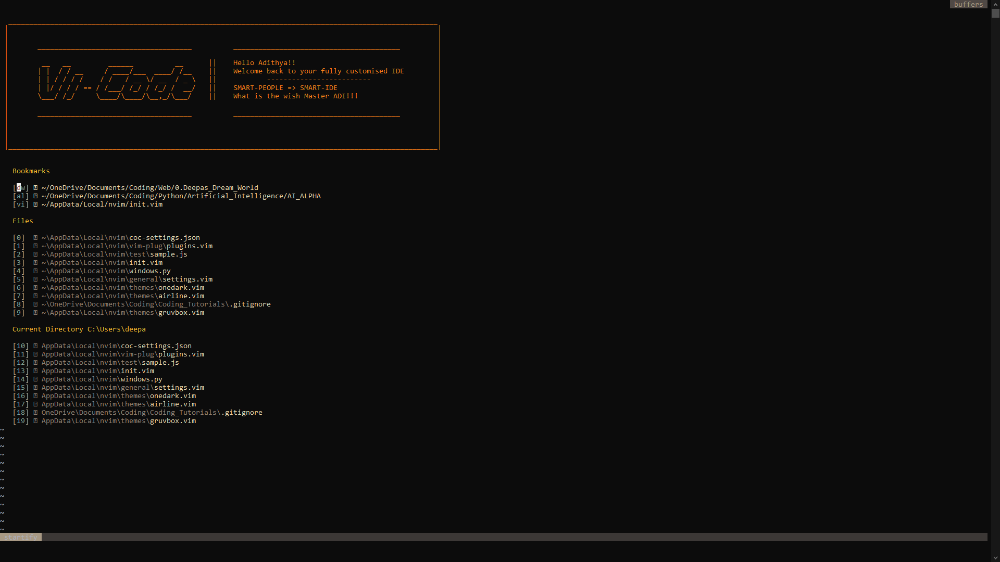
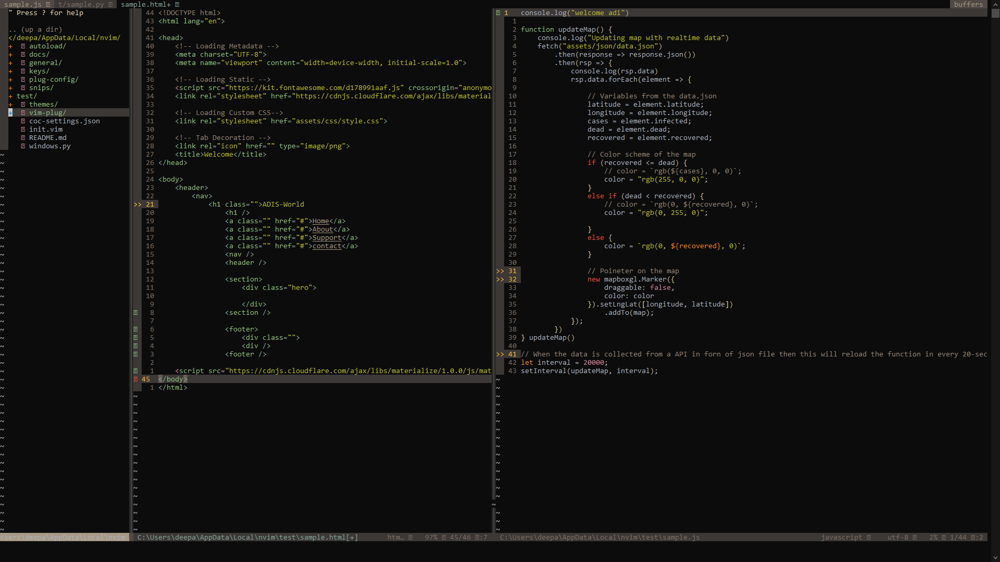

# ViCode
>
> ViCode is a setup for nvim it transforms the classical nvim to a ide like thing 
> It will have many features inbuilt and If you want You can also add Your Own new features
>
> ## Screenshots
> - HomeScreen
>
>   
>
>
> - CodeScreen
>
>   

 # How To Use
> 
> ## Install Neovim
> To use this first you need to have neovim installed If it is not installed install it.
> 
> ```
> https://github.com/neovim/neovim/wiki/Installing-Neovim
> ```
>

> ## Install Needed Dependencies
> You also want to have some dependencies installed
>   - NodeJS
>   - Pynvim
>       
> Install Node JS
> ```
> https://nodejs.org/en/ 
> ```
>
> Install Pynvim
> ```bash
> pip install pynvim
> ```
>

> ## Download The Setup
> 
> - Clone the repository
>   ```bash
>   git clone https://gitlab.com/AdithyanA2005/nvim_setup.git
>   ```
>
> - Install Configurations
>   ```bat
>   cd nvim_setup
>   ```
>
>   ```bat
>   python makevicode.py
>   ```
>

> ## Install Plugins
> - ### Open Neovim
>   ```bash
>   nvim
>   ```
>
> - ### Install coc extensions 
>   ```vimlsp
>   :CocInstall coc-flutter coc-emmet coc-html coc-vimlsp coc-spell-checker coc-snippets coc-tabnine coc-clangd coc-json coc-java coc-cmake coc-python
>   ```
>   Click [here](https://github.com/neoclide/coc.nvim/wiki/Using-coc-extensions#implemented-coc-extensions) to see the full List of coc Extensio, If you want you can also download one off them
>

> ## Custom Mapping
> - ``` 
>   gr (codefix) 
>   ```
>
> - ```
>   gd (go to definition)
>   ```
>
> - ```
>   gr (rename symbol)
>   ```
>
> - ```
>   gf (format current file)
>   ```
>
> - ```
>   K  (for documentation)
>   ```
>
> - ```
>   alt + hjkl to resize window.
>   ```
>
> - ```
>   ctrl + hjkl for window navigation.
>   ```
>  
> - ```
>   ctrl + n to redraw status bar.
>   ```
>  
> - ```
>   jk and kj for "ESC"
>   ```
>  
> - ```
>   space (leader key).
>   ```
>

> ## Plugins Included
>
> - [Gruvbox](https://github.com/morhetz/gruvbox)  
> - [Airline](https://github.com/vim-airline/vim-airline) 
> - [Onedark](https://github.com/joshdick/onedark.vim)
> - [Startify](https://github.com/mhinz/vim-startify)  
> - [Signify](https://github.com/mhinz/vim-signify)  
> - [Nerdtree](https://github.com/preservim/nerdtree)  
> - [Auto Pairs](https://github.com/jiangmiao/auto-pairs)  
> - [Rainbow_Parenthesis](https://github.com/junegunn/rainbow_parentheses.vim)
> - [Cpp Highlight](https://github.com/octol/vim-cpp-enhanced-highlight) 
> - [Gitgutter](https://github.com/airblade/vim-gitgutter')
> - [Fugitive](https://github.com/tpope/vim-fugitive)
> - [Rhubarb](https://github.com/tpope/vim-rhubarb)
> - [GV](https://github.com/junegunn/gv.vim)
> - [Unimpaired](https://github.com/tpope/vim-unimpaired)  
> - [Which Key](https://github.com/liuchengxu/vim-which-key)  
> - [Devicons](https://github.com/ryanoasis/vim-devicons)
> - [COC](https://github.com/neoclide/coc.nvim)  
> - [Floaterm](https://github.com/voldikss/vim-floaterm)
> - [Commentary](https://github.com/tpope/vim-commentary)
> - [Pug_Complete](https://github.com/dNitro/vim-pug-complete)
> - [Pug](https://github.com/digitaltoad/vim-pug)
> - [Snippets](https://github.com/honza/vim-snippets)
> - [Rnvimr](https://github.com/kevinhwang91/rnvimr)
